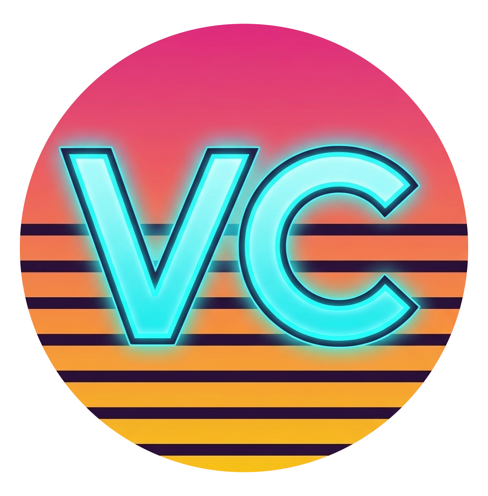
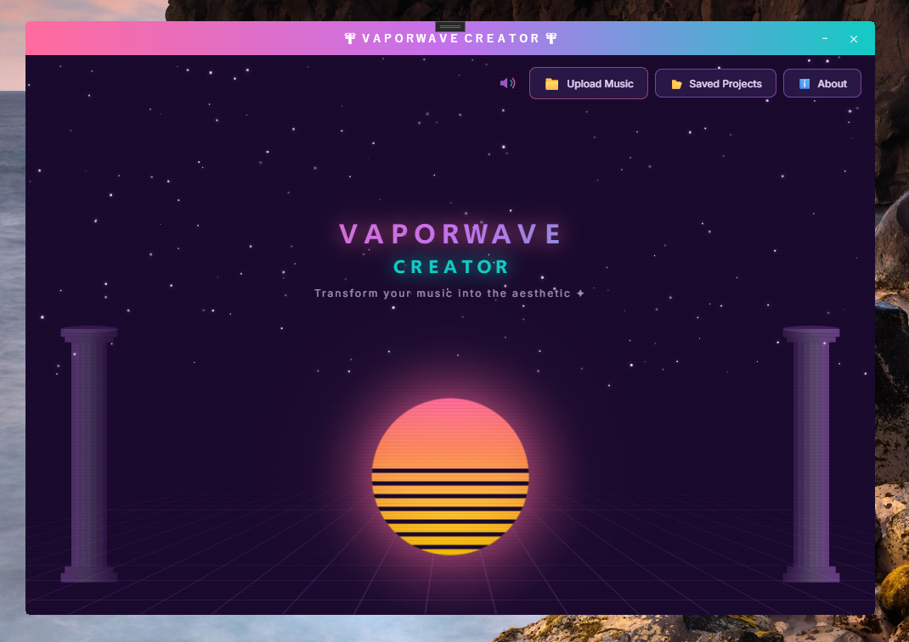
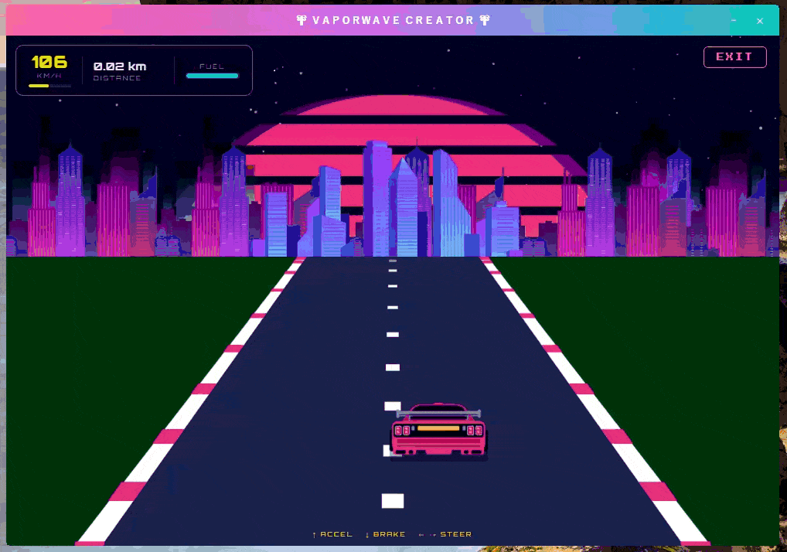
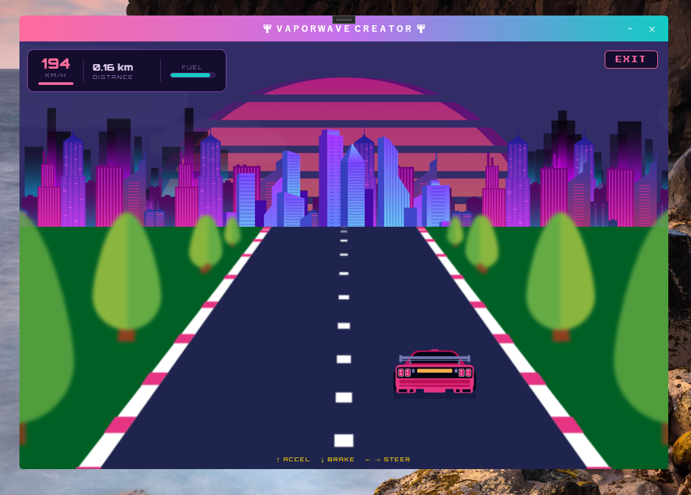
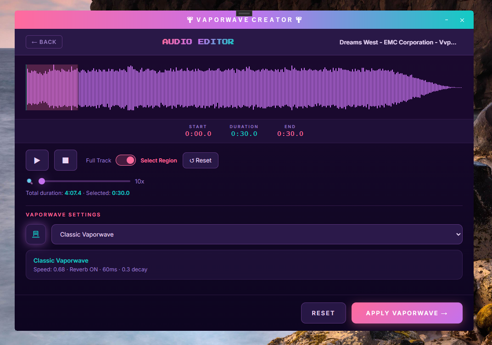

<p align="center">
  
</p>

# Vaporwave Creator For Windows (1.0.0)

<p align="center">
  
  
  
  
  
  
  
</p>

A retro-aesthetic desktop app that combines an **audio editor** with a built-in **arcade racing game** — all wrapped in a neon-soaked vaporwave interface. Built with C#/WPF and React.

<p align="center">
  
  <br/><em>Home — Vaporwave landing with animated sun, retro grid, and neon pillars</em>
</p>

<p align="center">
  
  <br/><em>Arcade Game — Gameplay demo</em>
</p>

<p align="center">
  
  <br/><em>Arcade Game — Night mode with starfield and streetlights</em>
</p>

<p align="center">
  
  <br/><em>Audio Editor — Waveform visualization with drag-and-drop upload</em>
</p>

## Features

- **Audio Editor** — Upload .mp3/.wav files via drag-and-drop, visualize waveforms with WaveSurfer.js, and process audio directly in the browser-based UI.
- **Arcade Racing Game** — A fully playable 80s-style arcade racing game with perspective roads, day/night cycles, obstacles, fuel management, progressive difficulty, sound effects, and a retro HUD.
- **Vaporwave Aesthetic** — Every pixel screams 1980s: neon gradients, retrowave grids, Press Start 2P fonts, and synthwave color palettes.
- **Hybrid Architecture** — C#/WPF shell with WebView2 rendering a React frontend, communicating through a custom bridge service.

## How to install this application?

This application is made for **Windows (x64)** and can be downloaded from the [Releases Page](https://github.com/micilini/VaporwaveCreator/releases).

Simply download the latest `.zip`, extract it, and run `VaporwaveCreator.exe`.

## How to run this application locally?

This application was made using the following technologies:

- **C#** (.NET 8.0)
- **Windows Presentation Foundation (WPF)**
- **ReactJS** (Vite + React Router)
- **WebView2** (bridge between C# and React)

### Prerequisites

Make sure you have the following installed on your machine:

1. **Visual Studio Community 2022** (or later) with the `.NET Desktop Development` workload.
2. **Node.js** (v18 or later) and **npm**.
3. **.NET 8.0 SDK**.

### Step 1 — Clone the repository

```bash
git clone https://github.com/micilini/VaporwaveCreator.git
cd VaporwaveCreator
```

### Step 2 — Build the React frontend

The React project lives inside the `webmodel/` folder. You need to install dependencies and generate the production build that C# will load via WebView2.

```bash
cd webmodel
npm install
npm run build
```

This will generate a `dist/` folder with the static files.

### Step 3 — Open and run in Visual Studio

1. Open `VaporwaveCreator.sln` in Visual Studio.
2. Make sure the build configuration is set to `Debug` / `x64`.
3. Press **F5** to build and run.

The WPF app will launch, load the WebView2 control, and serve the React frontend from the `webmodel/dist/` folder.

### Project Structure

```
VaporwaveCreator/
├── VaporwaveCreator/              # C# WPF project
│   ├── Views/
│   │   └── Controls/
│   │       ├── WebViewControl.xaml       # WebView2 host control
│   │       └── WebViewControl.xaml.cs    # WebView2 initialization + bridge
│   ├── Services/
│   │   ├── AudioService.cs              # Audio playback service
│   │   └── MusicPlayerService.cs        # Music player logic
│   ├── Models/
│   │   └── HostMessage.cs               # Message model for JS↔C# bridge
│   ├── Resources/
│   │   └── init.mp3                     # Startup sound
│   ├── MainWindow.xaml                  # Main window (chrome, title bar)
│   ├── MainWindow.xaml.cs
│   ├── App.xaml / App.xaml.cs           # Application entry point
│   └── VaporwaveCreator.csproj
│
└── webmodel/                      # React frontend (Vite)
    ├── src/
    │   ├── pages/
    │   │   ├── Home/                    # Landing page with vaporwave sun
    │   │   ├── ArcadeGame/             # Full arcade racing game
    │   │   │   ├── index.jsx           # Game logic (physics, fuel, obstacles)
    │   │   │   ├── arcade.css          # Game styles (1000×660 viewport)
    │   │   │   ├── car.svg             # Player car
    │   │   │   ├── car-b.svg           # Player car (brake lights)
    │   │   │   ├── ceu.svg             # Sky/cityscape
    │   │   │   ├── sol.svg             # Sun
    │   │   │   ├── tree.svg            # Roadside trees
    │   │   │   ├── streetlight.svg     # Streetlights
    │   │   │   ├── street.svg          # Road reference
    │   │   │   └── freio.mp3           # Brake screech SFX
    │   │   ├── AudioEditor/            # Waveform audio editor
    │   │   └── Error404/               # 404 page
    │   ├── services/
    │   │   └── webViewConnectionsService.js  # JS↔C# bridge
    │   ├── main.jsx                    # React entry point
    │   └── index.css                   # Global styles
    ├── package.json
    └── vite.config.js
```

### Modifying the frontend

If you want to change the UI, modify files inside `webmodel/src/`. After making changes:

```bash
cd webmodel
npm run build
```

Then re-run the WPF project in Visual Studio. The WebView2 control will load the updated build.

### Running the React dev server (optional)

For faster frontend development with hot-reload:

```bash
cd webmodel
npm run dev
```

This starts a Vite dev server (usually at `http://localhost:5173`). Note that C#↔JS bridge features won't work in this mode — it's only useful for pure UI/layout work.

## The Arcade Game

The built-in arcade game features:

- **Perspective 3D road** with animated dashes, edge bands, and pink rumble strips.
- **Day/night cycle** (120s) with dawn, sunset, starfield, clouds, and animated sun.
- **Fuel system** — fuel burns constantly (even when idle). Collect red fuel cans on the road to survive.
- **Obstacles** — rocks and holes appear in 3 lanes. Hitting them costs fuel.
- **Progressive difficulty** — the game gets harder every 4 km: fuel burns faster, obstacles spawn more frequently, and fuel pickups become rarer.
- **Scenery** — dense forest of trees and streetlights on both sides, spawning in realistic staggered groups.
- **Sound design** — engine rumble (Web Audio API), collision thuds, liquid fuel pickup sound, and brake screech (freio.mp3).
- **Game Over + Try Again** — with neon-pulsing text and distance score.

### Game Controls

| Key | Action |
|-----|--------|
| ↑ / W | Accelerate |
| ↓ / S | Brake |
| ← / A | Steer Left |
| → / D | Steer Right |

## Tech Stack

| Layer | Technology |
|-------|------------|
| Desktop Shell | C# / .NET 8.0 / WPF |
| Browser Engine | WebView2 |
| Frontend | React 18 + Vite |
| Routing | React Router v6 |
| Audio Visualization | WaveSurfer.js |
| Game Audio | Web Audio API + HTML5 Audio |
| Fonts | Press Start 2P, Orbitron (Google Fonts) |
| Styling | Pure CSS (no frameworks) |

## Contributing

Want to contribute to **Vaporwave Creator**? Feel free to:

1. Fork the repository.
2. Create a feature branch (`git checkout -b feature/my-feature`).
3. Commit your changes (`git commit -m 'Add my feature'`).
4. Push to the branch (`git push origin feature/my-feature`).
5. Open a **Pull Request**.

Bug fixes, new game features, audio editor improvements, and UI enhancements are all welcome.

## Music Credits

Background music: **"Uplifting Trance"** by **Eliveta**.
Licensed under [Pixabay Content License](https://pixabay.com/service/license-summary/) (free for commercial and non-commercial use).
Available at [Pixabay](https://pixabay.com/music/techno-trance-uplifting-trance-1951/).

## License

This project is open-source and available under the **MIT License**.
